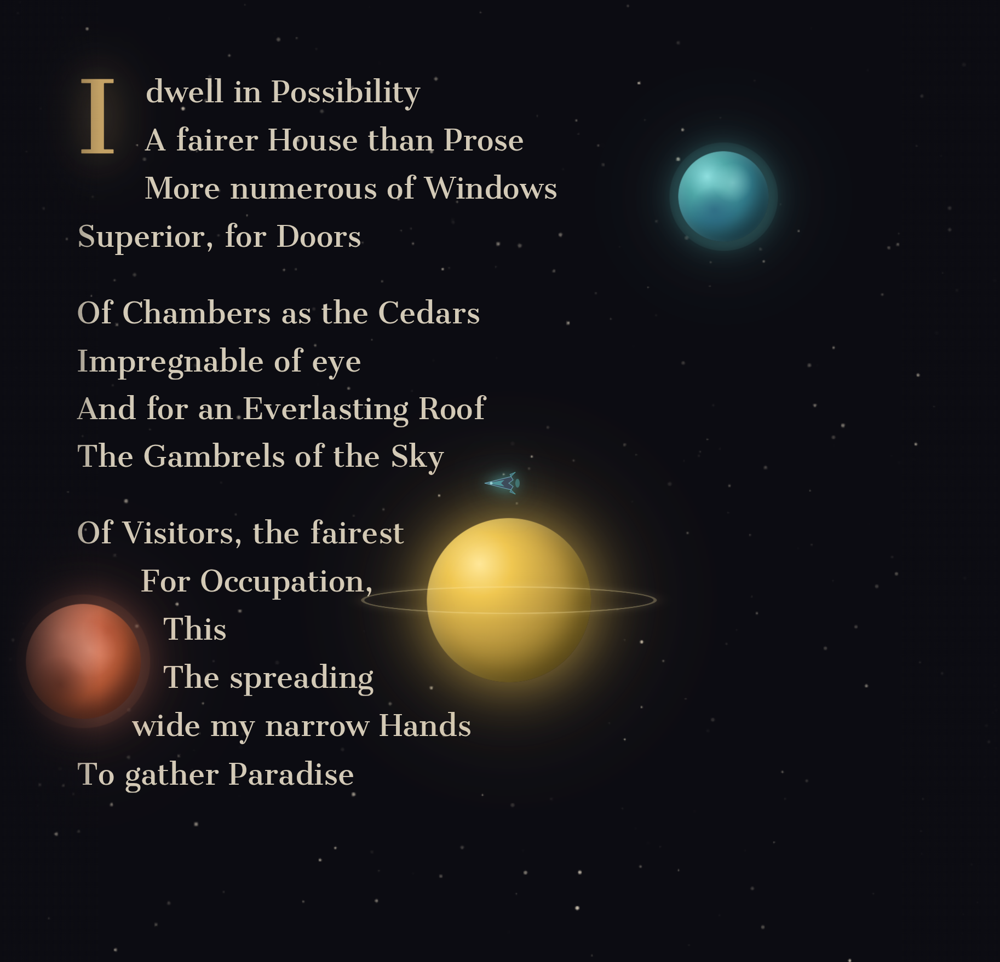

# Pretext Wars

A browser-based arcade space shooter where the battlefield is a poem.

Emily Dickinson's words wrap around planets in space. Aliens invade. You are a ship. Destroy the enemies — but the poetry is the world you're fighting through.



## Play

> **[Live demo](https://jameslcowan.github.io/pretext-wars/)**

No install needed — runs in any modern browser.

## What it is

Each game loads one of 12 Emily Dickinson poems, laid out across the screen with the text wrapping around draggable planets. Waves of aliens spawn and attack your ship. Defeating enemies drops tech-themed power-ups (TypeScript gives faster fire rate, Rust gives invulnerability, etc.). Bosses appear at score milestones.

The text isn't decoration — enemies shatter it when they die, and the layout shifts live as you drag planets around.

**Controls (desktop)**
- Mouse — move ship
- Click and hold — fire
- Drag planets — reflow the poem
- Esc — pause

**Controls (mobile)**
- Left joystick — move ship
- Auto-fire (no button needed)
- Left-handed mode available in the pause menu

## Run locally

```bash
npm install
npm run dev
```

Open `http://localhost:5173`. That's it.

```bash
npm run build    # production build → dist/
npm run preview  # preview the production build
```

Requires Node.js 18+.

## Tech

- **TypeScript** + **Vite**
- **[@chenglou/pretext](https://github.com/chenglou/pretext)** — text layout engine that wraps prose around arbitrary shapes
- **GSAP** — animations
- **Web Audio API** — all sound effects are procedurally generated (no audio files)
- **Canvas API** — starfield background
- No framework, no runtime dependencies beyond the above

## Project structure

```
src/
  main.ts    — game loop, entities, input, rendering
  text.ts    — poem content and text layout around planets
  audio.ts   — procedural sound effect generation
  style.css  — visual styling and planet gradients
```

## License

MIT — see [LICENSE](LICENSE).
